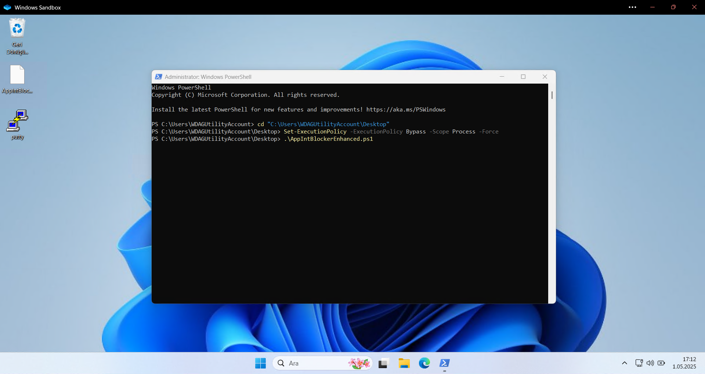
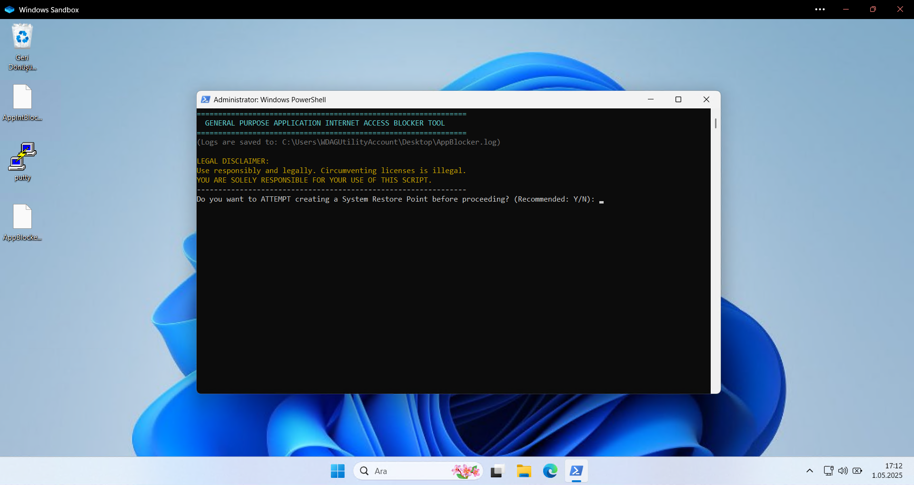
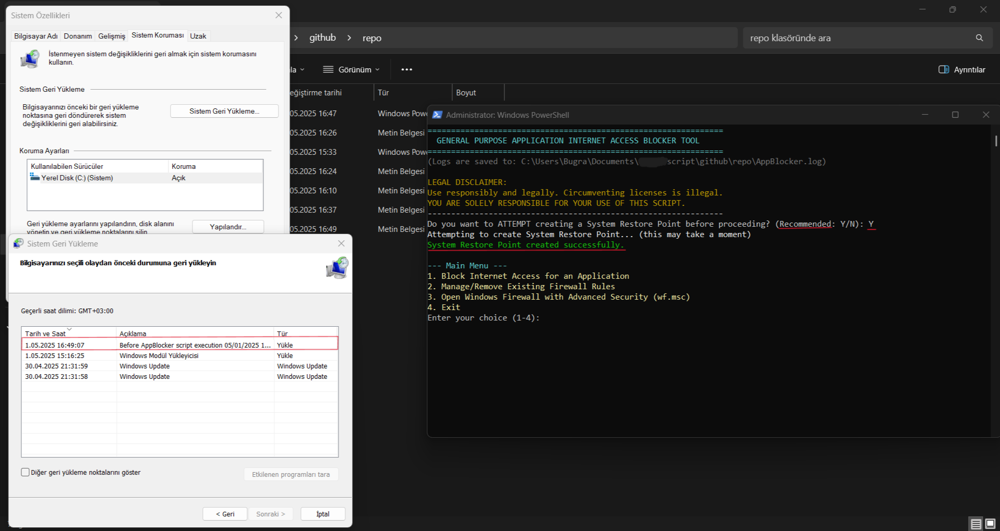
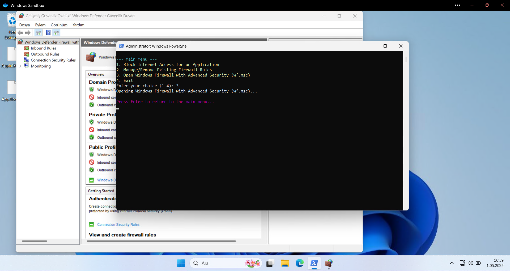
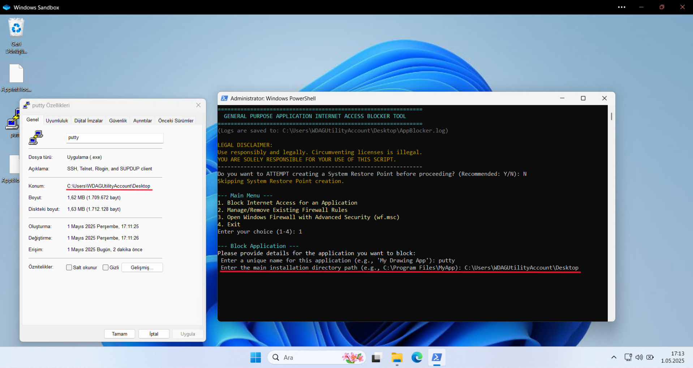
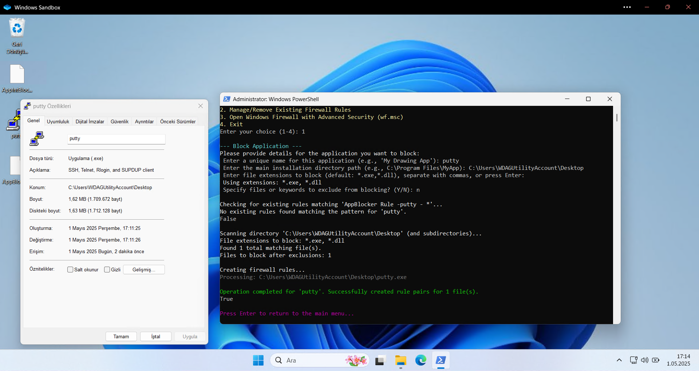
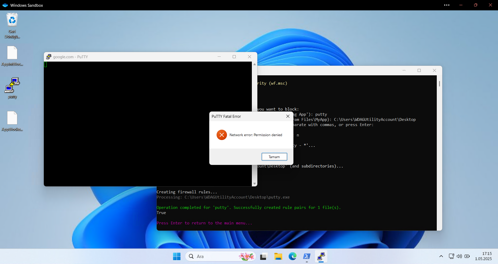
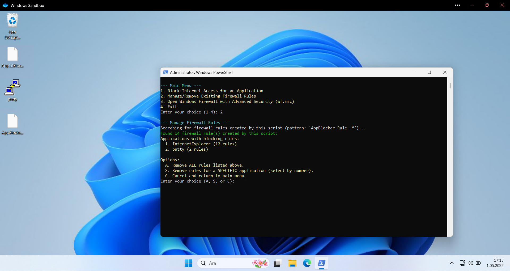
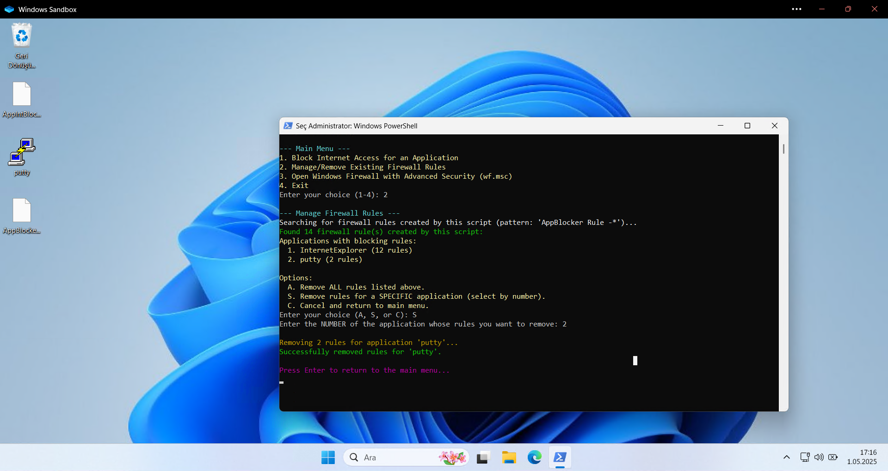
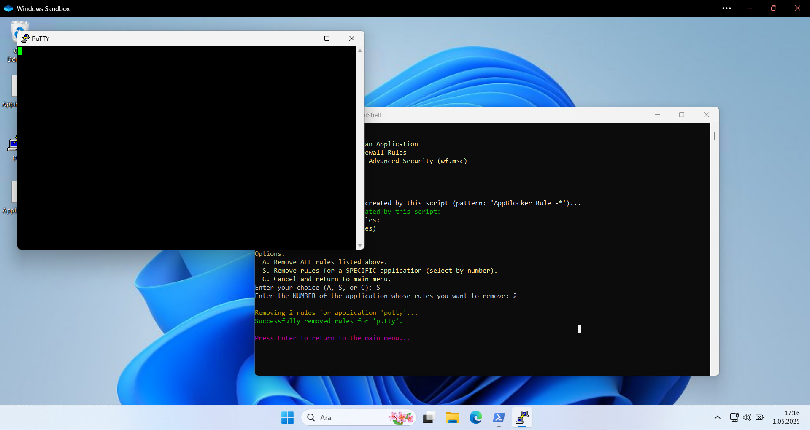

# Application Internet Blocker

A simple PowerShell script to block or manage internet access for specific applications using Windows Firewall rules. Features an interactive menu, system restore point creation, rule management, and logging.

## Features

*   Blocks internet access for specified `.exe`, `.dll`, or other file types within an application's directory.
*   Manages firewall rules created by this script (list, remove all, remove specific application's rules).
*   Offers to create a **System Restore Point** before making changes (recommended).
*   Provides a shortcut to open **Windows Firewall with Advanced Security**.
*   Logs actions and errors to a local file (`AppBlocker.log`).
*   Uses built-in Windows Firewall (no third-party tools needed).
*   Easy-to-use interactive menu system.
*   **General-purpose:** Does not target specific software or interfere with licensing.

## Disclaimer

*   Use this script responsibly and legally.
*   Intended for personal, educational, or administrative tasks where you have permission to modify network access.
*   This script **does not** crack, patch, or bypass any software licensing.
*   The author is not responsible for any misuse.

## Requirements

*   Windows 10 / Windows 11 or later
*   PowerShell 5.1+
*   **Run as Administrator** (required for Firewall and System Restore changes).
*   System Restore must be enabled on your system drive for the restore point feature to work.

## How to Use

1.  Download the script (`.ps1` file) to your computer.
2.  Open **PowerShell as Administrator**.
3.  Navigate to the directory where you saved the script using the `cd` command:
    ```powershell
    cd "C:\path\to\your\script" 
    # Replace C:\path\to\your\script with the actual path
    ```
4.  (Optional, only if you encounter an error) Allow script execution for the current session:
    ```powershell
    Set-ExecutionPolicy -ExecutionPolicy Bypass -Scope Process -Force
    ```
5.  Run the script:
    ```powershell
    .\AppBlocker.ps1 
    # Replace AppBlocker.ps1 with the actual script file name
    ```
6.  The script will start and present you with an interactive menu:
    *   It will first ask if you want to create a System Restore Point.
    *   Then, the main menu will appear with options like:
        *   Block Internet Access for an Application
        *   Manage/Remove Existing Firewall Rules
        *   Open Windows Firewall with Advanced Security
        *   Exit
7.  Follow the on-screen prompts to select options and provide necessary information (like application name, path, extensions, exclusions).

### Usage Examples (Screenshots)












## Logging
The script creates a log file named `AppBlocker.log` in the same directory where the script is run. This file records the actions performed and any errors encountered.

## AI Assistance
This script was developed with assistance from AI models: Claude 3.7 Sonnet and Gemini 2.5 Pro Preview.

## License

This project is licensed under the [MIT License](LICENSE). 